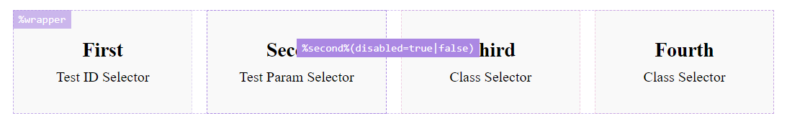

# E2EToolkit: Element Lookup Assistant

**Element Lookup Assistant** being a part of `e2e-toolkit` allows you to find out a particular element's **test id** very quickly.

## Initialization
```ts
import('e2e-toolkit-ela').then(({ ELAComponent }) => {
    ELAComponent({
        pseudoSelectorMap: {
            'first': '.first',
            'second': '.second input[disabled=true]',
            'third=$name': '.third[label=$name]',
            'fourth=$name': '.fourth:has(strong:contains($name), em:contains($name))'
        }
    });
})
```

## Configuration
### Default config
```ts
export interface ELAConfig {
    customSelectorPrefix: string
    pseudoSelectorPrefix: string
    activateShortcut: string
    relocateShortcut: string
    pseudoSelectorMap: Record<string, string>
}

const defaultConfig: ELAConfig = {
    customSelectorPrefix: '%',
    pseudoSelectorPrefix: '%%',
    activateShortcut: 'ctrl+alt+l',
    relocateShortcut: 'ctrl+alt+p',
    pseudoSelectorMap: {}
};
```
### Pseudo-selector's `$name` parameter
`e2e-toolkit` allows the `$name` parameter be in any part of a target query-selector,
but it's not so easy to go in the opposite direction and get a pseudo-selector without knowing 
what name is going to be used, so ELA restricts you to use the `$name` parameter 
only as a value for an attribute or `:contains()` selector.
```ts
const config = {
    pseudoSelectorMap: {
        /* OK */
        'foo1=$name': '.foo[label=$name]', // ok
        'foo2=$name': '.foo[label*=$name]', // ok
        'foo3=$name': '.foo:contains($name)', // ok
        
        /* OK for q helper, but won't work in ELA */
        'foo4=$name': '.foo[label=prefix_$name]',
        'foo5=$name': '.foo:contains($name_postfix)',
        'foo6=$name': '.foo.prefix_$name',
    }
}
```

## Usage
### Activate
Use `CTRL+ALT+L` shortcut on your site to activate ELA


Click on a custom- or a pseudo-selector name to copy it to the clipboard and use it in your test cases along with `q` helper.
Click on a selector with a pressed `CTRL` key to copy a full path to the element (but remember it's not necessary to use a full path to reach the element, keep it as short as possible).

You can also use `CTRL+ALT+P` to change tooltip's positioning if tooltips start overlapping each other.
